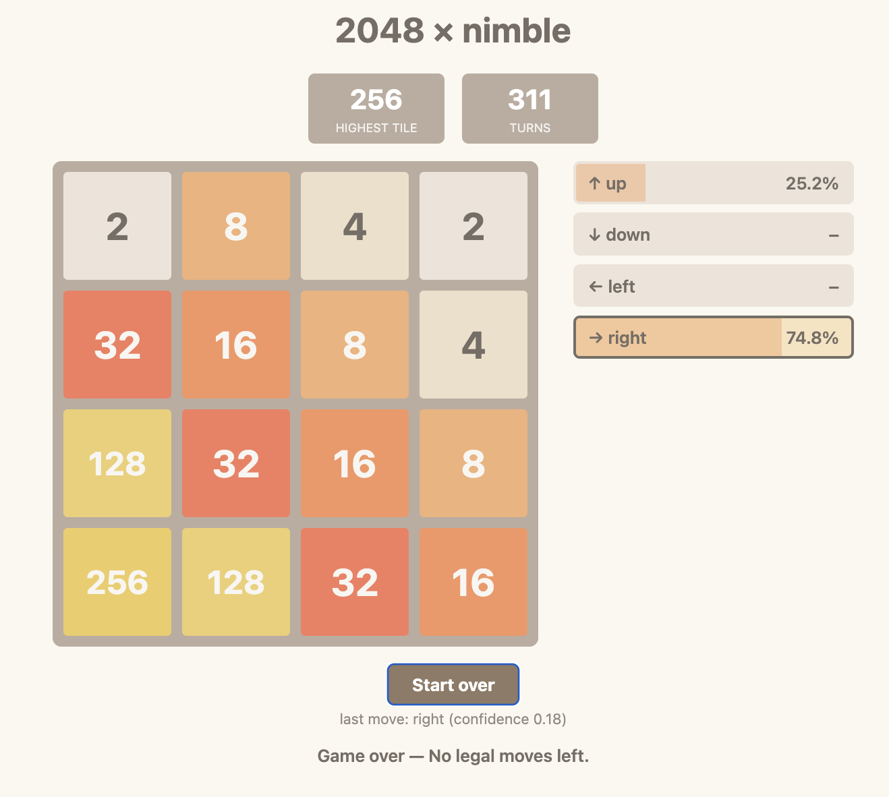

# nimble2048

2048 played by the local `nimble` classifier, with a live web visualiser.

Install Ollama: https://ollama.com/download and run

Download the `nimble` model: `ollama pull nimble`

Run:  `uv run play.py [--port 8048] [--delay 0.15] [--model nimble]`

Open: http://localhost:8048



Ollama supports a [Jev-style classifier](https://ollama.com/blog/ollama-now-supports-jev-style-decision-models) and can be called as an API locally. This script sends a representation of the current board and some gameplay instructions to the `nimble` model (0-shot each move) and recieves a classification of moves and their probabilities. The highest probability legal move is then played.

The core of the interface is the request

```python
def ask_classifier(url, model, board, legal):
    body = {
        "model": model,
        "state": describe(board, legal),
        "questions": {
            "move": {
                "type": "choice",
                "instructions": INSTRUCTIONS,
                "criteria": {m: None for m in legal},
            }
        },
    }
    req = urllib.request.Request(url, data=json.dumps(body).encode())
    with urllib.request.urlopen(req, timeout=60) as resp:
        ans = json.load(resp)["answers"]["move"]
    probs = ans.get("probabilities") or {}
    ranked = sorted(legal, key=lambda m: probs.get(m, 0), reverse=True)
    choice = ans.get("choice") if ans.get("choice") in legal else ranked[0]
    return choice, ans.get("confidence"), probs
```

Built with Claude Code.